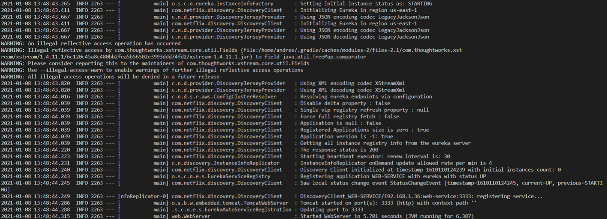
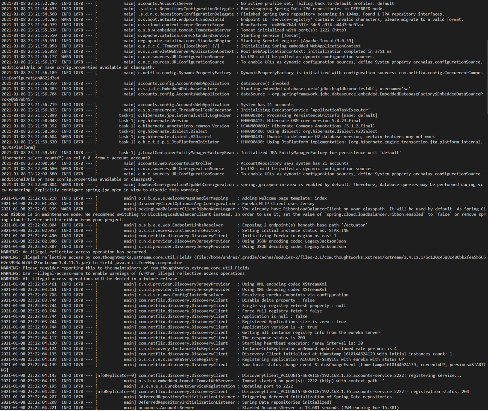
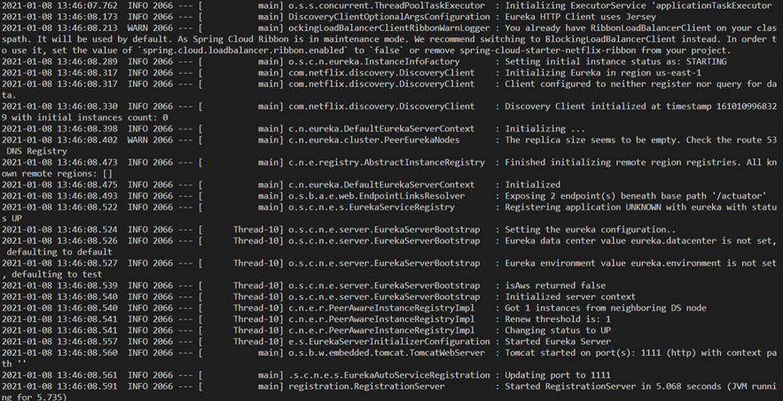
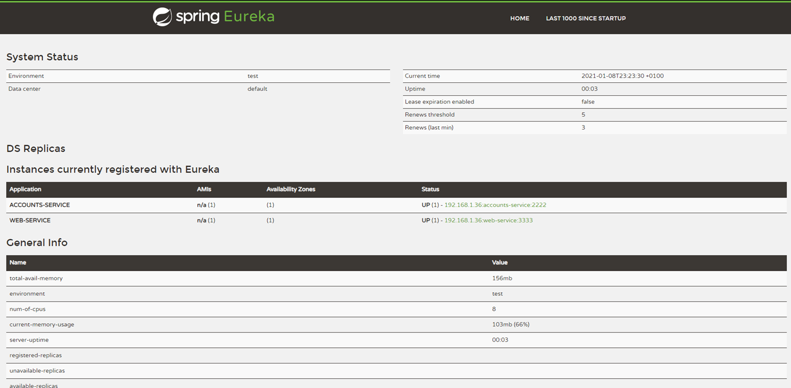
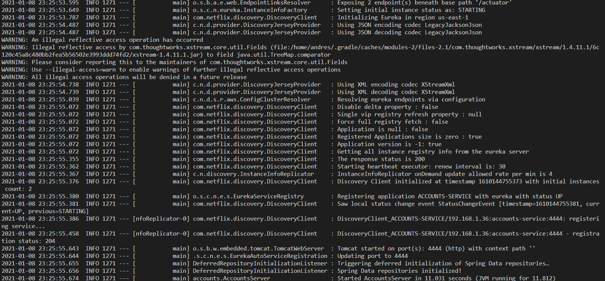
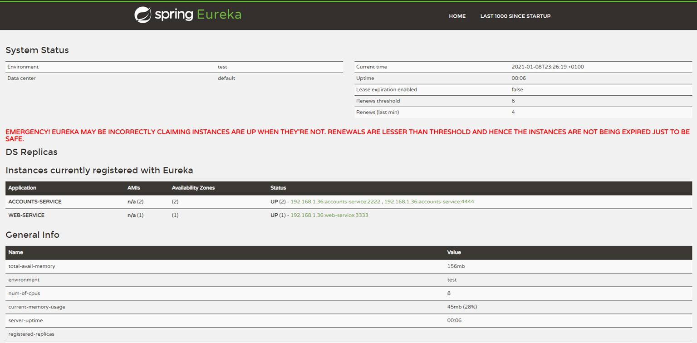
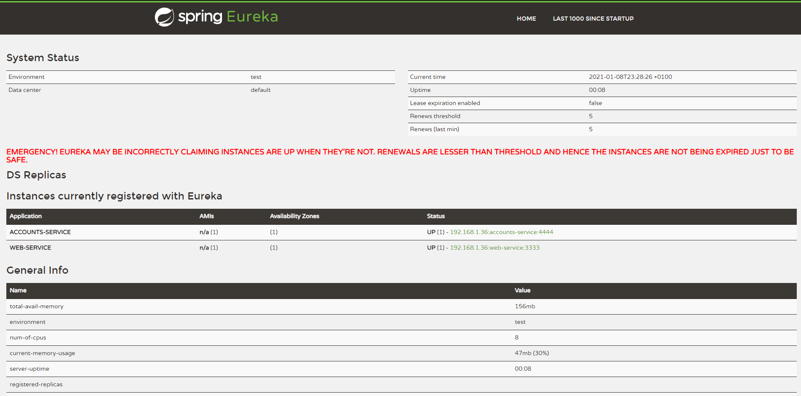
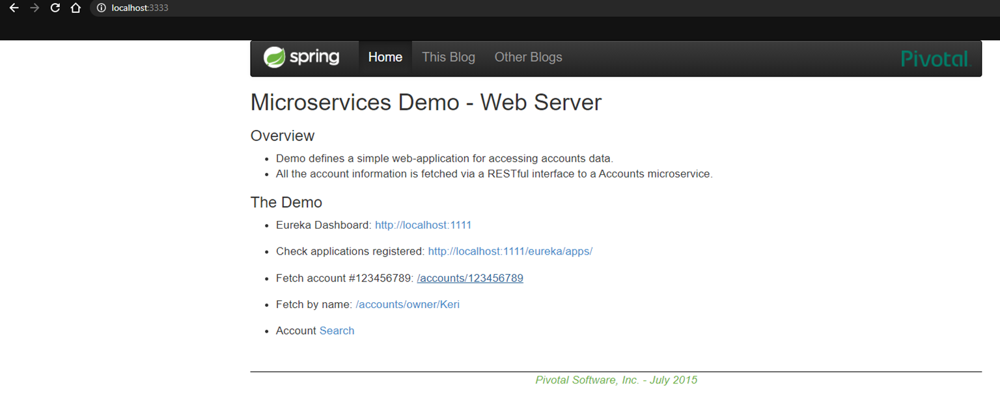
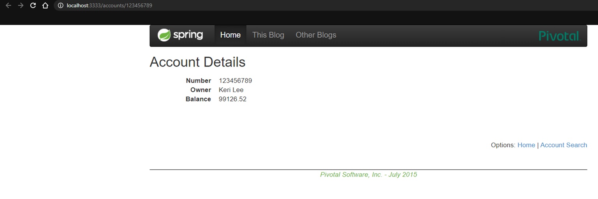

## Report

# The two microservices `accounts (2222)` and `web` are running and registered.

Service `web` is up and running on port 3333

Service `accounts` is up and running on port 2222

# The service registration service has these two microservices registered

Service `registration` is up and running on port 1111. It registered services `web` and `accounts`.

The Eureka dashboard shows the two registered services.

# A second `accounts` microservice instance is started and will use the port 4444. This second `accounts (4444)` is also registered

Service `accounts` is up and running on port 4444

The Eureka dashboard shows the service on the two addresses.

# What happens when you kill the microservice `accounts (2222)` and do requests to `web`? Can the web service provide information about the accounts again? Why?

The Eureka dashboard now shows only the 4444 instance of service `accounts`.

The dashboard of service `web` works properly...

And allows for the use of account requests.

This happens because Eureka has registered the two addresses and works as a load balancer.
So in the case one of the ports fail to load, or is unreachable, the load balancer will send the request to the only available address.

